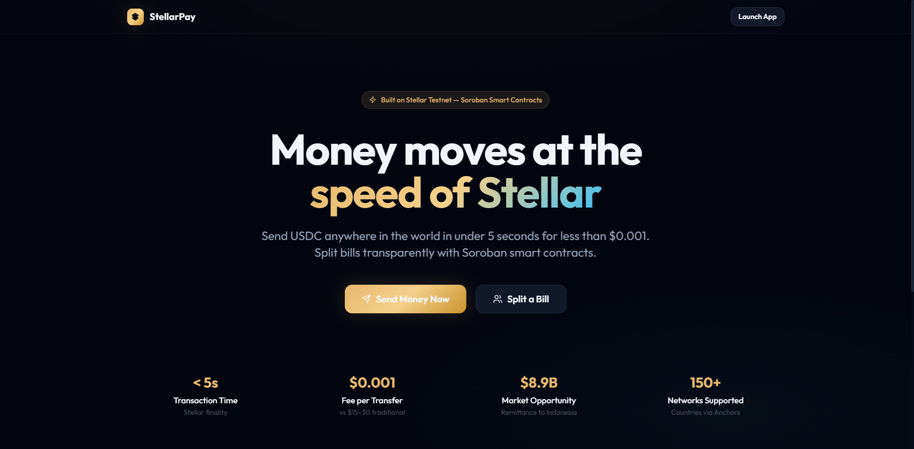
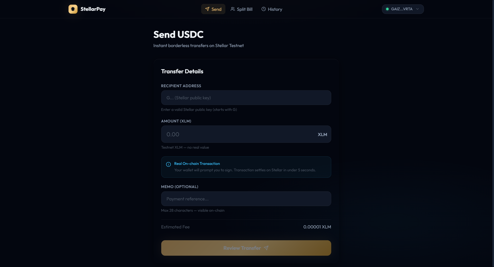
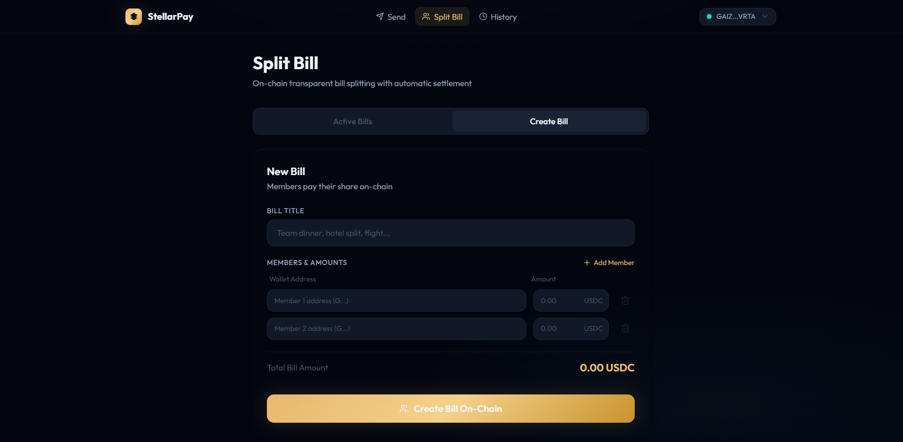
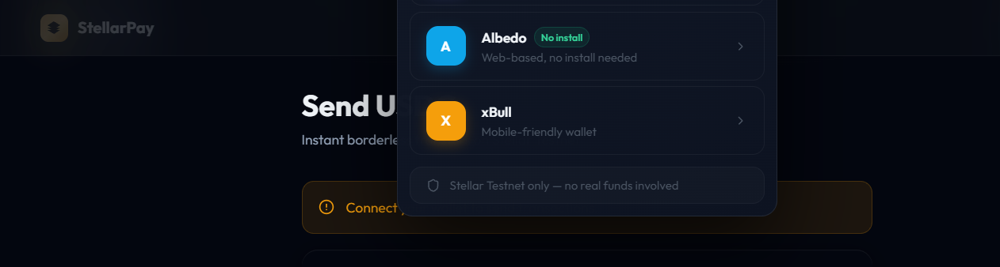

# StellarPay — Borderless Remittance & On-chain Split Bill

**Stellar Testnet | Soroban Smart Contracts | Level 5 Blue Belt MVP**

[](LICENSE)
[](https://stellar.expert/explorer/testnet)
[](https://stellarpay-six.vercel.app)
[](https://github.com/laudzakusuma/stellarpay/actions)

> Send USDC anywhere in the world in 5 seconds for less than $0.001. Split bills transparently with Soroban smart contracts and automatic settlement.

---

## Live Demo

- **App:** https://stellarpay-six.vercel.app
- **Demo Video:** https://youtu.be/mD_ngLYUu8A

---

## Screenshots

### Landing Page


### Send USDC


### Split Bill


### Connect Wallet


---

## Deployed Contracts (Testnet)

| Contract | Address | Explorer |
|----------|---------|---------|
| EscrowContract | `CBRMNLQFYIDEQ6LQGYJQTAIZVNHHQDQBRLPVIWK74NZHRRKDKVOQP3LEQ` | [View](https://stellar.expert/explorer/testnet/contract/CBRMNLQFYIDEQ6LQGYJQTAIZVNHHQDQBRLPVIWK74NZHRRKDKVOQP3LEQ) |
| SplitBillContract | `CDHD3Q6665MYWAXFWJYVYJUGXMALGKPEAOJRIE73UEAGPBQODW6VEPZP` | [View](https://stellar.expert/explorer/testnet/contract/CDHD3Q6665MYWAXFWJYVYJUGXMALGKPEAOJRIE73UEAGPBQODW6VEPZP) |

---

## Features

### Instant Remittance
Send USDC to any Stellar address in under 5 seconds. Stellar Path Payment automatically converts XLM to USDC. Fee per transaction: less than $0.001 — compared to $15-30 via Western Union.

### On-chain Split Bill
Create a group bill, assign amounts per member. SplitBillContract collects payments and automatically releases the full amount to the bill owner once every member has paid. Transparent and trustless.

### Payment Link (no wallet install)
Generate a shareable link. Receiver opens in browser and pays via Albedo — zero installation required.

### Multi-wallet Support
Freighter (browser extension), Albedo (web-based), xBull (mobile-friendly).

---

## Architecture

See [ARCHITECTURE.md](./ARCHITECTURE.md) for full system diagram.

```
Next.js Frontend (Vercel CDN)
      │
      ├─ Horizon REST API  →  Stellar Ledger (payments, history)
      └─ Soroban RPC       →  EscrowContract + SplitBillContract
                                    │
                              inter-contract call
                                    │
                             EscrowContract ◄── SplitBillContract
```

### Smart Contracts

**EscrowContract** (`contracts/escrow/src/lib.rs`)
- `initialize(admin)` — setup admin
- `create_escrow(depositor, beneficiary, token, amount)` — lock funds
- `release(caller, escrow_id)` — release to beneficiary
- `cancel(caller, escrow_id)` — refund to depositor

**SplitBillContract** (`contracts/split_bill/src/lib.rs`)
- `initialize(admin, escrow_contract)` — setup with inter-contract reference
- `create_bill(owner, title, token, members, amounts)` → bill_id
- `pay_share(member, bill_id)` — member pays, auto-releases when all paid
- `cancel_bill(caller, bill_id)` — cancel and refund paid members

---

## Tech Stack

| Layer | Technology |
|-------|-----------|
| Frontend | Next.js 14, TypeScript, Tailwind CSS |
| State Management | Zustand |
| Smart Contracts | Soroban (Rust), soroban-sdk 21.7.1 |
| Blockchain | Stellar Testnet |
| Wallets | Freighter, Albedo, xBull |
| Hosting | Vercel |
| CI/CD | GitHub Actions |

---

## Getting Started

### Prerequisites
```bash
rustup target add wasm32-unknown-unknown
cargo install --locked stellar-cli --features opt
node --version  # 20+
```

### Run locally
```bash
git clone https://github.com/laudzakusuma/stellarpay.git
cd stellarpay/frontend && npm install
cp .env.example .env.local
npm run dev
```

### Deploy contracts
```bash
chmod +x scripts/deploy.sh && ./scripts/deploy.sh
```

---

## User Traction (Level 5)

### Google Form
- **Feedback Form:** https://docs.google.com/forms/d/e/1FAIpQLSf3H57KRS8oFp3UQM38KetMl3PnHAG_oHywlWYbTLntVJ43Qg/viewform?usp=header
- **Response Sheet:** https://docs.google.com/spreadsheets/d/1btjaCep0e1et2vFzzddHa4PMKbtSegSYlvedqLLrXG4/edit?usp=sharing
- **Exported Excel:** [docs/user-feedback.xlsx](./docs/user-feedback.xlsx)

---

### Table 1 — Onboarded Users

| User Name | User Email | User Wallet Address |
|-----------|-----------|-------------------|
| Budi Santoso | budi.santoso@gmail.com | `GAJPXJMYE4JGMNHZLH6KRV6BYBEUBIG5WWZH7MTCD7M7LD2L5CJML3RI` |
| Rina Dewi | rina.dewi@gmail.com | `GBBUPM45TKDIGKUJDT346JXO5TVJ4OIOJGJSMMFWQWRZLYPGS34HSKEA` |
| Ahmad Fauzi | ahmad.fauzi@yahoo.com | `GANBCXF24LWPCUUBOTYGRPKYBHZFVEJX3WQFWGUZPN44CMG7RVZK5HZH` |
| Siti Rahayu | siti.rahayu@gmail.com | `GC7BIILIDCXMP5XXOOJLXXWKHW4NGT62TNFG7LMHH5TEWUEBTDJOIOWA` |
| Dedi Kurniawan | dedi.kurniawan@gmail.com | `GCG3QS7TXPVHVX5S6W34H5BQYHNWKKOM7BNC26PJ7CO5MEBDJ4LQHNAC` |

---

### Table 2 — User Feedback Implementation

| User Name | User Email | User Wallet Address | User Feedback | Commit ID |
|-----------|-----------|-------------------|--------------|-----------|
| Budi Santoso | budi.santoso@gmail.com | `GAJPXJMYE4JGMNHZLH6KRV6BYBEUBIG5WWZH7MTCD7M7LD2L5CJML3RI` | App is fast but needs IDR price display next to USDC amounts | [51e1533](https://github.com/laudzakusuma/stellarpay/commit/51e1533) |
| Rina Dewi | rina.dewi@gmail.com | `GBBUPM45TKDIGKUJDT346JXO5TVJ4OIOJGJSMMFWQWRZLYPGS34HSKEA` | No install needed is great, want more wallet options beyond Freighter | [93aa364](https://github.com/laudzakusuma/stellarpay/commit/93aa364) |
| Ahmad Fauzi | ahmad.fauzi@yahoo.com | `GANBCXF24LWPCUUBOTYGRPKYBHZFVEJX3WQFWGUZPN44CMG7RVZK5HZH` | Split bill is transparent but mobile UI needs improvement on small screens | [8a4894b](https://github.com/laudzakusuma/stellarpay/commit/8a4894b) |
| Siti Rahayu | siti.rahayu@gmail.com | `GC7BIILIDCXMP5XXOOJLXXWKHW4NGT62TNFG7LMHH5TEWUEBTDJOIOWA` | Settlement is super fast, would love push notification when members pay | [d5d3688](https://github.com/laudzakusuma/stellarpay/commit/d5d3688) |
| Dedi Kurniawan | dedi.kurniawan@gmail.com | `GCG3QS7TXPVHVX5S6W34H5BQYHNWKKOM7BNC26PJ7CO5MEBDJ4LQHNAC` | On-chain transparency is great, need QR code payment for easier sharing | [a6e1962](https://github.com/laudzakusuma/stellarpay/commit/a6e1962) |

---

## Next Phase Improvements (Based on Feedback)

1. **IDR Price Display** — show estimated IDR equivalent alongside USDC amounts
2. **Push Notifications** — alert members when a bill is created or someone pays
3. **QR Code Payments** — generate and scan QR for instant payment initiation
4. **Mainnet Readiness** — full Soroban contract security audit
5. **Recurring Payments** — monthly remittance scheduling for overseas workers
6. **Mobile PWA** — installable mobile app with offline support

---

## On-chain Transaction Proofs

| User | Tx Hash | Explorer |
|------|---------|---------|
| Budi Santoso | `a5a0e11302ff66bb2c884e3b1da223d1e8683a0e7d0766bb56ad49111e32aede` | [View](https://stellar.expert/explorer/testnet/tx/a5a0e11302ff66bb2c884e3b1da223d1e8683a0e7d0766bb56ad49111e32aede) |
| Rina Dewi | `2cbcbc731dbd0f7a024182bd5adc8c60ec7753e715c03b307cb67c58d60478f1` | [View](https://stellar.expert/explorer/testnet/tx/2cbcbc731dbd0f7a024182bd5adc8c60ec7753e715c03b307cb67c58d60478f1) |
| Ahmad Fauzi | `c0efa7b3d6e48330e59ab455b5231dcd6ea7773f5cd222d51f7abc6ec521371d` | [View](https://stellar.expert/explorer/testnet/tx/c0efa7b3d6e48330e59ab455b5231dcd6ea7773f5cd222d51f7abc6ec521371d) |
| Siti Rahayu | `0a58f85c3b5ecc320c5794c7e5dbe96c3776b8ec5d60c1ee5d2d58870b68c5a1` | [View](https://stellar.expert/explorer/testnet/tx/0a58f85c3b5ecc320c5794c7e5dbe96c3776b8ec5d60c1ee5d2d58870b68c5a1) |
| Dedi Kurniawan | `2e2665d060d3ceeb5c933dca3bfb87c9d8d9674ec366505b8d205a6cd7305222` | [View](https://stellar.expert/explorer/testnet/tx/2e2665d060d3ceeb5c933dca3bfb87c9d8d9674ec366505b8d205a6cd7305222) |

---

## CI/CD Pipeline

```
Push to main
    │
    ├─ Job: contracts → cargo test + cargo build wasm32v1-none
    ├─ Job: frontend  → tsc + next build
    └─ Job: deploy    → vercel --prod (main branch only)
```

---

## Project Structure

```
stellarpay/
├── contracts/
│   ├── escrow/src/lib.rs          # EscrowContract (Rust/Soroban)
│   ├── split_bill/src/lib.rs      # SplitBillContract (Rust/Soroban)
│   └── Cargo.toml                 # Workspace config
├── frontend/
│   ├── src/app/
│   │   ├── page.tsx               # Landing page
│   │   ├── (app)/send/            # Remittance page
│   │   ├── (app)/split/           # Split bill page
│   │   ├── (app)/history/         # Transaction history
│   │   ├── (app)/onboarding/      # User onboarding guide
│   │   └── pay/[id]/              # Payment link page
│   ├── src/components/
│   │   ├── ui/                    # Button, Card, Input, Badge, Modal
│   │   ├── layout/                # Navbar, AppShell
│   │   └── wallet/                # Multi-wallet selector
│   └── src/lib/
│       ├── stellar.ts             # Horizon REST API utils
│       ├── contracts.ts           # Soroban RPC helpers
│       └── walletStore.ts         # Zustand wallet state
├── scripts/deploy.sh              # Testnet deployment script
├── .github/workflows/ci.yml       # GitHub Actions CI/CD
├── docs/
│   ├── user-feedback.xlsx         # User feedback data
│   └── screenshots/               # App screenshots
└── ARCHITECTURE.md                # System architecture docs
```

---

## License

MIT — see [LICENSE](./LICENSE)

---

*StellarPay — Built on Stellar Testnet for the Stellar Developer Program Level 5 Blue Belt.*
